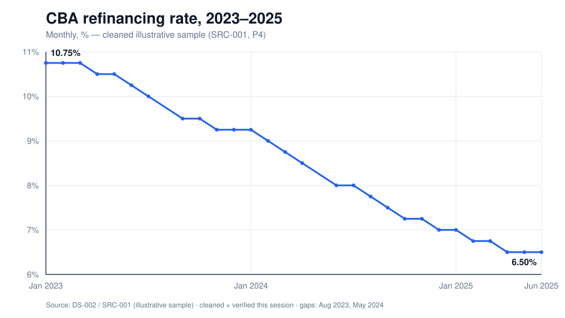

<!--
RPT-001 — CBA refinancing rate. Marp format (Markdown Presentation Ecosystem).
Render: npx @marp-team/marp-cli RPT-001-cba-refinance-rate.md -o RPT-001.html
(or --pdf / --pptx). The CHT-001 SVG must sit alongside this file.
Every figure traces to a cleaned DS-002 cell or the cleaning log; tone follows
.claude/rules/report-style.md.
-->

# The CBA Refinancing Rate, 2023–2025

**A cleaned view of the shipped illustrative sample**

Central Bank of Armenia · monthly refinancing rate
Prepared 2026-07-24 · data DS-002 / SRC-001 (illustrative, tier P4)

---

## Executive summary

**The refinancing rate fell from 10.75% (Jan 2023) to 6.50% (Jun 2025) — a decline of 4.25 percentage points (425 bp), roughly 40% lower over 30 months.**

- **Situation** — 30 monthly observations, Jan 2023 → Jun 2025, from the shipped CBA sample (cleaned this session).
- **Key finding** — the rate only ever *fell or held*; it never rose across the window (after correcting one data error).
- **Cause → effect** — the decline came as a sequence of mostly 25 bp reductions, then a pause: the rate has held at **6.50%** for the final three months (Apr–Jun 2025).
- **Implication** — the sample describes a sustained, orderly easing cycle that has flattened, not a volatile one.

---

## The data, and how it was cleaned

The source is an **illustrative sample (SRC-001, tier P4)** — *not* an authoritative figure. It arrived with quality issues, all fixed and independently verified before use:

| Issue found | Fix |
|---|---|
| 3 date formats (`01/03/2023`, `March 2024`, `2024/09/01`) | normalised to ISO `YYYY-MM-01` |
| `95.0` at Sep 2023 (decimal-point typo) | corrected to **9.5** (matches neighbours) |
| Duplicate row at Jan 2024 | de-duplicated |
| `7.25%` written with a unit | stripped to `7.25` |
| Two blank months (Aug 2023, May 2024) | left as **gaps** — not fabricated |

*Independent verification recomputed the series and every headline figure from the raw cells: **PASS**. Method logged in `analysis/cba-refinance-rate-cleaning-log.md`.*

---

## The trajectory

A steady descent from 10.75% to 6.50%, flattening through the first half of 2025.

---

## Key figures

| Metric | Value | Traces to |
|---|---|---|
| Start (Jan 2023) | **10.75%** | DS-002 first cleaned cell |
| End (Jun 2025) | **6.50%** | DS-002 last cleaned cell |
| Total change | **−4.25 pp (−425 bp)** | end − start |
| Relative decline | **≈ 40% lower** | (start − end) / start = 39.5% |
| Range | 10.75% → 6.50% | max / min of series |
| Direction | **monotonically non-increasing** | full cleaned series |
| Last 3 months | **held at 6.50%** | Apr–Jun 2025 cells |

Every value above resolves to a cleaned cell of DS-002 or the cleaning log.

---

## What it means

- The visible mechanism is a **disciplined easing cycle**: mostly 25 bp steps down, with occasional holds, and no reversals.
- The **pause at 6.50%** through Apr–Jun 2025 suggests the cycle has reached, at least temporarily, a floor within this sample.
- **The drivers are not in this dataset.** Why the rate was cut (inflation, FX, growth) is outside the file and is *not* asserted here — only the observed path is.
- Recommendation: treat this as an **illustrative** trajectory only; before any published or decision use, refresh from the official CBA source and extend past Jun 2025.

---

## Caveats & limitations

- **Illustrative sample (P4).** SRC-001 is a teaching sample, not an authoritative CBA figure — do not cite the levels as official.
- **Window ends Jun 2025.** The series does not cover the most recent period.
- **One corrected value** (Sep 2023, 95.0 → 9.5) and **two gaps** (Aug 2023, May 2024) — none of the headline figures depend on the corrected or missing points.
- No peer comparison is drawn here: the peer snapshot on file (RB-001) is dated 2026, a different period from this sample, so mixing them would not be like-for-like.

---

## Sources

- **DS-002** — `data/cba-refinance-rate.csv` → `data/cba-refinance-rate-cleaned.csv` (28 rows, 2023-01 … 2025-06).
- **SRC-001** — shipped illustrative CBA sample, tier **P4** (not authoritative).
- **Cleaning + verification** — `analysis/cba-refinance-rate-cleaning-log.md` (method + independent-check verdict: PASS).
- **Chart** — CHT-001 `presentations/CHT-001-cba-refinance-trajectory.svg`.

*Class: public. No internal or restricted data used.*
